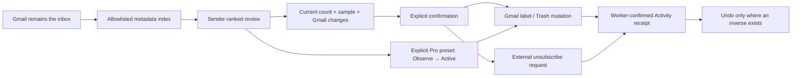

# Product experience audit — Gmail-native transition and launch surface

Date: 2026-07-12

Last reconciled: 2026-07-13 at `37455506`

Branch: `feat/d132-public-product-site`

Scope: authenticated product, onboarding, public website, trust copy,
instrumentation, SEO, and the current D/ADR constraints.

## Summary:

DeclutrMail's strongest market position is not "another inbox." It is a
Gmail control companion: Gmail remains the place to read, search, reply, and
compose; DeclutrMail reduces recurring inbox noise into inspectable sender
decisions. The product already has unusually strong foundations for that
position—deterministic recommendations, a canonical action registry, real
previews, worker-confirmed outcomes, an Activity record, and a narrow Gmail
data boundary.

The largest adoption risk is a trust-and-familiarity gap, not missing cleanup
power. A native Gmail user must learn five product verbs, a grouped
11-destination sidebar, manual-versus-future action scope, a separate Later
concept, and plan-specific recovery behavior. Any vague promise—especially
universal undo, "decide once" for future mail, or an "exact" privacy inventory
that omits persisted fields—makes that learning burden feel dangerous.

This buildout closes the public-product gap with one shared public shell, an
interactive synthetic inbox simulator that reuses production components, a
Gmail terminology bridge, product and methodology walkthroughs, a complete
Free/Plus/Pro tier story, five source-backed comparison pages, five Gmail
how-to guides, five direct-answer pages, three substantive essays, an
evidence-linked changelog with RSS, FAQ, sign-in, legal/support pages, and
recursive sitemap/`llms.txt` coverage. There are 36 indexable public routes;
`/demo` is a deliberate redirect to `/inbox-simulator`.

Authenticated experience slices after the public baseline also remove several of the
highest-trust Gmail transition gaps: Gmail round trips are mailbox-bound instead
of using browser account position; onboarding is tier-aware; navigation is
grouped by user job; recent undo follows the user across mailbox-scoped routes;
the Free cleanup cap is serialized on the workspace; priority read failures use
a distinct shared retry surface; and an expired active Gmail grant has a
target-bound, session-bound reconnect flow that returns to the exact Settings
row. Disconnected-account reactivation is separately target-bound, and every
new/reactivated mailbox activation is serialized at the authoritative database
boundary before it can consume a plan slot.

The public-site launch baseline was verified at commit `b80de6db`, before the
later authenticated-app commits listed above:

- Web, API, shared, and workers TypeScript: **pass**.
- Root tests: **2,941 passed, 11 skipped** across 263 files — web 1,084;
  API 939 + 10 skipped; shared 269; workers 513 + 1 skipped; events 75;
  db 61.
- Repository ESLint: **0 errors** (11 pre-existing unused-disable warnings).
  Prettier, `git diff --check`, executable rollback-script status, and
  `bash -n scripts/revert-pr.sh`: **pass**.
- Production Next.js build: **pass**, including all 63 generated page entries.
  Recursive HTTP smoke: **40/40** — all 36 sitemap routes plus `/demo`, RSS,
  `llms.txt`, and `robots.txt`; `/demo` resolves to `/inbox-simulator`.
- In-app browser: **pass** at 390 × 844 and 1440 × 900 on landing, pricing,
  simulator, comparison, and sign-in. Public/mobile navigation opens, closes on
  Escape, and restores focus; wide tables are keyboard-focusable internal
  scrollers; the consent close target is 44 px; landing has no document-level
  horizontal overflow. The simulator completed preview → confirm → Activity →
  undo, with no browser warning/error logs. The temporary viewport was reset.
- Browser QA caught and fixed three issues before this final run: a long trust
  sentence causing desktop overflow, paid cards incorrectly saying “No card
  required,” and a 36 px consent close target. New public-route traffic, demo
  preview/confirm/reset, pricing intent, and authenticated internal-UUID
  identity bridging remain consent-gated and privacy-scrubbed by implementation
  and tests.

Those exact counts prove the public launch baseline, not the current HEAD. CI
for `645ad79a` did not pass: two Senders tests still used a stale auth fixture;
`3dbfcd6b` corrects that fixture, and `37455506` adds a later hero-demo slice.
There is no subsequently recorded passing full regression on exact current
HEAD. That run and live OAuth/deployment smoke remain release gates.

## Strengths:

1. **Correct strategic unit:** sender-first review materially compresses the
   problem while Gmail continues to handle message reading and composition.
2. **Trustworthy mutation architecture:** previews, queued work, terminal
   worker confirmation, receipts, and verb-specific recovery are stronger
   than optimistic "done" UI.
3. **Deterministic recommendations:** volume, engagement, reply/protection
   signals, and explicit rules are inspectable; the product does not pretend
   to classify categories with an opaque model.
4. **Canonical product contracts:** KAULD verbs and tier capabilities come
   from shared registries/manifests, reducing public/app drift.
5. **Useful privacy wedge:** full bodies and attachments are not fetched; the
   public methodology now distinguishes the two bounded Anthropic paths and
   PostHog's non-Gmail product events.
6. **Recovery model:** Activity is a durable source of truth, Archive/Later
   have real inverse operations, and the recent undo tray now follows the user
   across mailbox-scoped routes. Delete points to Gmail Trash recovery only
   while Gmail still retains the message rather than claiming a universal
   client-side undo.
7. **Launch discoverability:** every built public route is represented in the
   sitemap and `llms.txt`; comparisons expose unknown states instead of
   converting missing evidence into favorable checkmarks.
8. **Reversibility of this buildout:** implementation slices and intentional
   D amendments are recorded in
   `docs/execution/d-break-ledger-2026-07-11.md`; a merged slice can be reverted
   with `scripts/revert-pr.sh <PR_NUMBER> --push`.
9. **Registry-backed plan enforcement:** single-sender Free actions remain
   available, while multi-sender actions are now checked against the canonical
   selector tier before preview resolution and enqueue; the UI and structured
   402 upgrade path mirror the server rule.
10. **Entitlement checks at execution:** Autopilot apply/action workers now
    re-read the canonical capability before evaluating rules or touching Gmail.
    A Free/Plus downgrade leaves queued matches unapplied and preserves the
    user&rsquo;s prior Observe/Active state for a safe future upgrade.
11. **Mailbox-bound idempotency:** unsubscribe replay keys are reserved before
    policy/activity/outbox effects and bound to mailbox, sender ID, sender key,
    and verb. Cross-mailbox or cross-sender reuse fails with a structured 409
    instead of returning foreign identifiers or action handles.
12. **Conversion continuity without redirect risk:** pricing carries the exact
    Plus/Pro plan, billing cycle, and eligible promotion through Google OAuth
    and first-run onboarding. Both API callback and web route accept only a
    canonical local `/billing` destination, and billing opens the validated
    choice only after its authoritative availability read succeeds.
13. **Untrusted demo state fails closed:** simulator persistence accepts only
    canonical synthetic rows, verbs, sender names, recomputed counts, unique
    safe timestamps, and the exact versioned object shape. A malformed snapshot
    is discarded as a whole instead of crashing or rendering forged Activity.
14. **Export copy matches the export:** Settings and Privacy now enumerate the
    mailbox, sender-policy, message-metadata, and decision/activity datasets
    actually returned, plus the explicit exclusions. They no longer promise an
    “everything” export that omits preferences, billing, or encrypted OAuth
    credentials.
15. **Mailbox-safe Gmail round trips:** one canonical URL service binds open,
    search, sender, and compose links to the intended mailbox with `authuser`;
    no production caller constructs `/u/0` links. Stale direct-message links
    can fall back to a bounded sender/subject/date search using already-stored
    metadata.
16. **Atomic Free cleanup allowance:** legacy, composite, and unsubscribe
    cleanup writes hold a finite-tier workspace lock across quota re-check and
    the consuming insert. Real PostgreSQL concurrency coverage proves distinct
    requests cannot all claim the final Free unit.
17. **Account recovery is explicit:** mailbox health refreshes in Settings and
    while the account dialog is open; invalid grants stay visible, suppress the
    doomed Sync-now action, and offer reconnect even when the already-counted
    mailbox is at the plan limit. Targeted OAuth state is authenticated,
    time-bounded, bound to the originating live session and mailbox identity,
    and returns controlled, privacy-safe results to Settings.
18. **Error and navigation semantics are clearer:** shared retryable
    `ErrorState` has alert semantics, a 44 px action, and is visually distinct
    from successful empty data. It now covers the priority cold-read failures in
    Triage, Screener, Snoozed, Autopilot, Admin Security, Brief, Senders,
    Follow-ups, Billing, sender policies, and sender detail while preserving the
    sender 404 and billing-disabled states. Sidebar destinations are grouped and
    labelled as Decide, Automate, Review, and Account.
19. **Browser diagnostics minimize by construction:** Sentry remains lazy-only;
    automatic browser breadcrumbs, request/user/context data, exception text,
    frame locals, and arbitrary identifiers are dropped. Only closed diagnostic
    tags/types and canonical hashed Next.js asset identities survive, while
    transaction, replay, profile, log, metric, and direct browser CSP-report
    paths are disabled.

## Risks & Concerns:

### Gmail-native friction inventory

| Priority | Friction                                                       | Why a Gmail user hesitates                                                                                                                                                                | Current response                                                                                                                                                                                                                                                       |
| -------- | -------------------------------------------------------------- | ----------------------------------------------------------------------------------------------------------------------------------------------------------------------------------------- | ---------------------------------------------------------------------------------------------------------------------------------------------------------------------------------------------------------------------------------------------------------------------- |
| P0       | Gmail deep links assumed `/u/0`                                | A multi-account user can land in the wrong mailbox, breaking the most basic round-trip trust                                                                                              | Shipped: the canonical Gmail URL service binds open/search/sender/compose links to the mailbox email with `authuser`; production code no longer constructs `/u/0`, and stale message links have a bounded search fallback                                              |
| P0       | "Decide once" can imply future-mail policy                     | Manual Archive/Later/Delete currently affect the previewed messages, not all future mail                                                                                                  | Public copy and demo corrected; founder must choose whether standing sender rules are still desired                                                                                                                                                                    |
| P0       | Unsubscribe was described like reversible mailbox work         | A delivered request leaves DeclutrMail and cannot be recalled                                                                                                                             | Canonical safety copy, legal/help, simulator, methodology, landing, and comparisons now state the one-way boundary                                                                                                                                                     |
| P0       | Later is not Gmail Snooze                                      | Users expect a return time; DeclutrMail/Later is a label/review queue and its management surface is Pro-gated even when Free can invoke the action                                        | Public Gmail mapping added; recovery route/tier mismatch remains a founder decision                                                                                                                                                                                    |
| P0       | Privacy headline can be read as the whole system inventory     | The locked list omits accepted outbound-recipient, unsubscribe, outbound-flag, and size metadata plus operational OAuth/action/account/billing records and bounded third-party processing | Public policy now lists non-message records and both Anthropic paths; the locked allowlist itself is founder-gated and already tracked in follow-ups                                                                                                                   |
| P0       | Free could reach multi-sender actions through a forged request | A UI-only plan gate would let an under-tier client resolve a bulk preview or enqueue work that the Action Registry marks Plus-only                                                        | Implemented server checks before preview resolution and enqueue, disabled under-tier bulk controls/shortcuts, structured 402, and global upgrade flow                                                                                                                  |
| P0       | Downgraded workspaces could retain queued Autopilot effects    | A plan check only at rule creation leaves a race where an already-queued worker mutates Gmail after Pro access ends                                                                       | Apply/action worker choke points now re-check `hasCapability(tier, 'autopilot')`; Free/Plus do no evaluation, rescheduling, or Gmail effects                                                                                                                           |
| P0       | Unsubscribe replay keys were not fully mailbox-bound           | Reusing one idempotency key across inboxes or senders could expose another request&rsquo;s result identifiers and couple side effects                                                     | Transactional reservation plus mailbox/sender/verb binding now returns 409 on conflicting reuse and preserves same-request replay                                                                                                                                      |
| P0       | Mailbox scope is not always obvious                            | In a two-inbox Pro workspace, users need to know which account a count, action, Gmail link, or rule belongs to before confirming                                                          | Destructive previews name the active Gmail account; Gmail round trips are mailbox-bound; and the account dialog shows selected, disconnected, syncing, and needs-reconnect states                                                                                      |
| P1       | Strict initial-sync blockade                                   | Waiting without a useful shell feels broken and hides value until the most failure-prone step completes                                                                                   | Accurate progress and error recovery remain; a useful read-only progressive shell still needs testing and a D6 decision                                                                                                                                                |
| P1       | Onboarding presented Pro automation to Free users              | The first-run promise can become an upsell before the user completes one useful action                                                                                                    | Shipped: tiers without Autopilot get a no-rules first-sender-review handoff and never mount the preset query; Pro retains the explicit preset step                                                                                                                     |
| P1       | Product vocabulary precedes familiar Gmail language            | Keep/Protect, Later/Snooze, Activity/undo, Observe/Active, Triage, Screener, Brief, and Quiet all arrive at once                                                                          | Public Gmail companion and sign-in expectation page bridge terms; authenticated labels still need progressive disclosure                                                                                                                                               |
| P1       | Eleven destinations had equal visual weight                    | A Gmail immigrant sees product architecture, not a guided cleanup journey                                                                                                                 | Shipped: the sidebar is journey-ordered and accessibly labelled as Decide, Automate, Review, and Account; locked surfaces show their required plan, but unavailable/advanced routes are not yet collapsed                                                              |
| P1       | Undo visibility was surface-dependent                          | Leaving Triage hid the recent-action control even though Activity remained the durable recovery destination                                                                               | Shipped: the mailbox-scoped app shell mounts one mailbox-keyed tray across routes, handles stale/terminal tokens safely, and keeps Activity as the durable record                                                                                                      |
| P1       | Expired Gmail access looked retryable                          | A normal "Try again" action cannot repair a revoked grant and repeated sync attempts feel broken                                                                                          | Shipped for active grants: invalid-grant state stays visible, hides Sync now, remains reconnectable at plan limit, binds OAuth to the live session and exact mailbox identity, gates its new sync, then returns a controlled one-shot result to the Settings row       |
| P1       | Disconnected-account reactivation was not identity-bound       | Clicking Reconnect beside one disconnected address could choose a different Google account and leave the intended history disconnected                                                    | Shipped: reactivation uses a distinct signed target, verifies the returning Google identity, preserves normal slot consumption, and returns a mailbox-specific privacy-safe result                                                                                     |
| P1       | New-mailbox activation limit had a callback race               | Two simultaneous successful OAuth callbacks could both pass a read-before-upsert inbox-limit check                                                                                        | Shipped: a workspace row lock covers the authoritative ownership/quota reread, activation, and sync-intent write; active reconnects remain idempotent and a real PostgreSQL race test proves one winner at the last slot                                               |
| P1       | Preview behavior is inconsistent                               | Several app actions bypass the same preview pattern used by sender cleanup, weakening learned safety                                                                                      | Mail-moving confirmations now fail closed when live scope is missing and name the active account; keep harmless Keep immediate and finish reconciling the remaining action surfaces                                                                                    |
| P1       | Session payoff implied future mail was prevented               | Adding a sender's monthly volume after a one-time Archive/Later or an unsubscribe attempt converted an estimate into an outcome claim                                                     | Replaced with terminal worker `affectedCount` as "messages moved"; unsubscribe attempts add no projected future volume                                                                                                                                                 |
| P1       | Paid pricing choices disappeared during sign-in                | After choosing Plus/Pro and a cycle, a Gmail user could finish OAuth/onboarding at a generic page and have to reconstruct the decision                                                    | A strict local billing intent now survives auth/onboarding and preselects the exact live checkout state; invalid or external destinations are dropped                                                                                                                  |
| P1       | Free cleanup quota was not concurrency-serialized              | Many distinct concurrent idempotency keys could all pass the read-before-write cap check, granting more than five Free actions in one burst                                               | Shipped: finite tiers lock the workspace through quota re-check and consuming legacy/composite/unsubscribe writes; replay remains idempotent, and a real-PostgreSQL test exercises the race                                                                            |
| P1       | Three canonical outcome events do not reach analytics          | `rule_fired`, `unsubscribe_attempted`, and `billing_event` are typed and documented, but no server-to-PostHog emitter completes those terminal/webhook funnels                            | Activity and billing logs retain operational evidence; add a consent-aware terminal-event sink before building PostHog cohorts from these names                                                                                                                        |
| P2       | Error and empty states shared visual treatment                 | A failed fetch can look like an empty mailbox, producing incorrect user decisions                                                                                                         | Shipped for priority cold reads: one alert-based, responsive recovery surface now covers the major list/detail/settings screens with a 44 px Retry action and tested error → retry → success behavior; compact inline/card failures remain a separate consistency task |
| P2       | Mobile tables, cards, and drawer behavior drift                | Small targets, horizontal density, missing focus containment/Escape behavior, and selection bars make cleanup harder on mobile                                                            | The account disclosure now has bounded viewport geometry, ordinary Tab flow, Escape/focus restoration, and responsive wrapping; the broader 390/768/1440 app sweep remains open                                                                                        |
| P2       | Color/spacing/width primitives drift                           | Literal colors, residual violet, inconsistent max widths, and per-screen headers make the product feel assembled rather than designed                                                     | Adopt shared PageShell/PageHeader/content-width/status-color primitives before further feature work                                                                                                                                                                    |

### Launch and product-truth blockers

- **Privacy contract ratification:** the locked six-item message list in
  `CLAUDE.md` §2.1 and `packages/shared/src/copy/privacy.ts` says it is exact,
  while accepted ADR-0004/ADR-0021 and the schema also store outbound To/Cc
  recipients; unsubscribe HTTPS/mailto URLs and sender URL/method; the RFC
  8058 one-click flag; the derived outbound flag; and whole-message size
  estimate. If "exact" is interpreted system-wide, it also omits account
  identity/preferences, encrypted OAuth tokens and mailbox/sync state, sender
  decisions/automation, action jobs/Activity/undo identifiers, and
  billing/customer/subscription references. Surrounding policy copy now names
  operational classes and processors, but only a founder-ratified D-decision
  can reconcile the locked artifact. Until then, this is a launch blocker.
- **Annual Pro price:** D126 says $149/year while the current manifest says
  $190/year. Public pricing continues to derive from the manifest; the conflict
  remains explicit.
- **Canonical host:** apex `declutrmail.com` versus `app.declutrmail.com` must
  be settled before indexing and OAuth redirect review.
- **Paid conversion is operationally disabled:** deploy configuration still
  sets `BILLING_ENABLED=false`, and provider catalog price IDs are not present.
  Public paid CTAs therefore lead to the honest billing-disabled product state,
  not a purchasable checkout. Enable and verify the provider catalog before a
  commercial launch.
- **CORS correction requires a production redeploy:** the workflow source now
  accepts both apex and `app` origins without the `gcloud` comma-separator bug,
  but production does not change until that revision is deployed and smoked.
- **D193 launch capacity is still in development mode:** the API deploy command
  still sets `--min-instances=0`, while D193 requires one warm instance so the
  OAuth callback does not cold-start at launch. Restore the API to
  `--min-instances=1`, deploy, and smoke the live redirect path before launch.
- **Current-HEAD regression proof:** the recorded full suite, production build,
  recursive route smoke, and browser pass apply to `b80de6db`. CI at
  `645ad79a` failed two stale Senders fixture tests; `3dbfcd6b` fixes that
  fixture, but no passing full regression has since been recorded on exact HEAD
  `37455506`. This draft is not yet a release candidate.
- **Operational proof:** a current redacted CASA letter, live support/privacy
  mailboxes, payment catalog IDs, production OAuth redirects, a real
  multi-account Gmail round-trip, and the new target-bound reconnect flow
  cannot be proved by repository tests alone.
- **Comparison freshness:** competitive facts are dated "Last verified July
  2026" and link primary sources. They require a scheduled re-check, not a
  permanent claim.

## Trade-offs & Alternatives:

| Choice                                 | Selected posture                                                                                                     | Alternative                                         | Consequence                                                                                                                                                                          |
| -------------------------------------- | -------------------------------------------------------------------------------------------------------------------- | --------------------------------------------------- | ------------------------------------------------------------------------------------------------------------------------------------------------------------------------------------ |
| Gmail companion vs replacement inbox   | Keep Gmail as the reading/reply/search surface                                                                       | Build a full mail client                            | Companion posture lowers scope/access risk and preserves muscle memory; it must provide excellent round trips                                                                        |
| Synthetic demo vs live OAuth sandbox   | Local synthetic data using production TriageRow and ActionPreview                                                    | Require Gmail connection before proof               | Synthetic demo gives safe pre-auth understanding; it must stay visibly illustrative and never imply a real mailbox mutation                                                          |
| Manual action scope vs standing rules  | Manual cleanup affects only the preview; enabled Pro presets affect future matches                                   | Make every sender verdict a permanent future rule   | Current split is safer and more inspectable, but "decide once" marketing must remain scoped                                                                                          |
| Familiar labels vs expert vocabulary   | Add Gmail mappings and staged education                                                                              | Rename every power feature                          | Mapping protects the distinctive product model; authenticated UI should still default to plain-language subtitles                                                                    |
| Strict sync gate vs progressive access | Current gate remains until tested                                                                                    | Show partial sender index/read-only app during sync | Progressive access may improve activation, but counts and readiness must never be presented as final                                                                                 |
| One handoff branch vs atomic PRs       | Keep small reviewable commits on one draft branch; the original public build maps to fourteen proposed ledger slices | Merge as an undifferentiated monolith               | Commit boundaries preserve handoff context, but `revert-pr.sh` becomes independently useful only after a slice has its own merged PR; otherwise use a deliberate targeted Git revert |
| Worker hard-stop vs rewriting rules    | Re-check entitlement at both mandatory Autopilot worker choke points                                                 | Rewrite Active/Observe rules to Paused on downgrade | The selected gate is immediately reversible and preserves intent; rewriting would erase whether each rule had been Active or Observe                                                 |

## Actionable Recommendations (Priority-Ordered):

1. **Resolve the six founder product decisions:** the locked privacy allowlist,
   manual future-mail scope, Later recovery access, progressive sync
   onboarding, default plain/power labels, and the $149/$190 annual Pro
   conflict. Canonical host is a seventh launch-operational decision.
2. **Re-prove the integrated branch:** run the complete test/typecheck/lint/
   format/build suite and the 390/768/1440 browser smoke on exact HEAD, then
   exercise production OAuth, a two-Gmail-account round trip, target-bound
   reconnect success/cancel/mismatch, billing-disabled truth, and CORS after
   deployment with the D193 API minimum restored to one warm instance. Preserve
   redacted evidence rather than upgrading repository tests into live claims.
3. **Make the first value loop Gmail-familiar:** Connect → accurate sync state →
   one synthetic practice row → one real previewed sender decision → Activity
   receipt → mailbox-bound "Open in Gmail." Free/Plus now skip the Autopilot
   preset step; validate this whole loop with activation data before adding more
   first-run concepts.
4. **Finish authenticated consistency:** converge PageShell/PageHeader and
   content-width/status primitives; add a compact inline recovery primitive for
   card/row failures; retain the shipped full-screen recovery, grouped
   navigation, mailbox context, disclosure focus contract, and shell-level undo.
5. **Create a recovery contract:** every confirmation must state (a) messages
   affected now, (b) future-mail effect, (c) Gmail destination, (d) recovery
   mechanism/window, and (e) whether an external unsubscribe request is
   one-way. Activity is the canonical destination.
6. **Use the data already emitted to run a weekly product review:**
   - acquisition: public family view → demo preview → demo confirm → OAuth CTA;
   - activation: connect → sync success → first real preview → first confirmed
     action → onboarding finished;
   - trust: preview abandonment, recommendation override rate, undo/regret rate
     by verb and token age, Autopilot pause/reject rate, unsubscribe outcomes;
   - value: terminal worker-confirmed affected messages, time to first safe
     decision, weekly sender decisions, repeat-week rate, and observed future
     Autopilot outcomes; never infer recurring noise prevented from a one-time
     sender-volume estimate;
   - monetization: free-cap prompt → checkout start → verified billing event,
     split by the value already received before the prompt.
7. **Repair telemetry interpretation before optimizing from it:** auth now
   identifies with internal UUID after consent and requests a best-effort
   identity reset on logout without allowing analytics failure to block local
   cache clearing or navigation. The on-screen D33 payoff now uses terminal
   affected-message counts instead of projected monthly volume. Next, connect
   the currently dark `rule_fired`, `unsubscribe_attempted`, and
   `billing_event` contracts to a consent-aware terminal/webhook sink; verify
   server-side sync/action events join the same user/workspace model; and
   publish a dashboard dictionary so an unsubscribe request is never read as
   confirmed sender compliance.
8. **Keep public proof alive:** re-verify competitor sources quarterly, update
   changelog entries from shipped evidence, add screenshots only from a tested
   release, and never add testimonials/outcome percentages until first-party
   data supports them.
9. **Run accessibility and responsive acceptance as a release gate:** keyboard
   navigation, visible focus, reduced motion, dialog focus containment, 44 px
   touch targets, no horizontal overflow, and semantic heading/table structure
   at 390, 768, and 1440 px.

## Next Steps:

1. Keep the draft PR open for handoff. Do not mark it ready until the locked
   privacy contract, billing/catalog, canonical host, CORS redeploy, D193 warm
   API minimum, exact-current-HEAD regression, and CASA/live OAuth/operational
   proof are resolved or explicitly waived by the founder.
2. Review the existing small commits as distinct behavioral units. If downstream
   review splits them into separate PRs, map each merged PR in the D-break
   ledger and use `scripts/revert-pr.sh <PR_NUMBER> --push`; the script does not
   make individual commits independently reversible inside one merged PR.
3. Complete the founder/operations checklist (privacy ratification, host,
   annual price, support/privacy mailboxes, billing catalog, OAuth/CASA
   evidence).
4. Establish the weekly funnel/trust dashboard and take the next product bet
   from observed drop-off—not from route count or feature volume.

## Optional Architecture Blocks:

The architectural rule is simple: every downstream effect must preserve
mailbox context, current-versus-future scope, and recovery truth all the way
back to the preview that authorized it.
